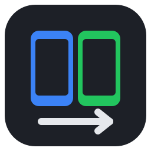

# Device Automation Dashboard

A Windows desktop app that drives several real Android phones at once through
Appium, to automate repetitive cross-app work (copy from one app, paste into
another, click through a third). Each phone gets its own Appium session and
thread, so starting, stopping or plugging in one phone never disturbs the
others.



## Features

- **Dashboard** — live list of connected phones, a script picker and Start/Stop
  per phone, a live log per phone, and a **Run History** tab.
- **Script Builder** (no code) — add steps with forms: apps, clicks, copy/paste
  and typing, scrolls, swipes, taps, keys, waits, screenshots. Includes
  **Repeat** and **If element exists / Otherwise** blocks with nested steps,
  per-step **retries** and **stop-on-failure**, and `{{variable}}` placeholders
  in any text.
- **Wi-Fi phones** (Ctrl+Shift+W) — switch a USB phone to Wi-Fi with one click
  (`adb tcpip`), pair Android 11+ phones with a pairing code, or connect by IP.
  Connected phones are remembered and reconnected automatically; a phone on
  both USB and Wi-Fi is listed once.
- **Cross-phone workflows** — give steps a phone role (`A`, `B`, …): one script
  copies on phone A and pastes on phone B, sharing variables. At run time you
  choose which real phone plays each role.
- **Element Picker & Recorder** — a live screenshot of the phone: hover and
  click an element to see its attributes and the best locator (unique ones
  first), add it as a step, or turn on **Record clicks** to build a script by
  using the app. Unlabelled buttons are found through a labelled child
  (`//*[@content-desc="Video"]/..`), positional paths are flagged as fragile,
  and recorded clicks keep a backup tap position.
- **Repeat runs** — run N times or until stopped, with a pause between runs.
- **Schedules** — run scripts daily at set times on chosen weekdays, or every N
  minutes. Busy or unplugged phones are skipped and logged.
- **Run reports** — every run saves a JSON and an HTML report, with a
  screenshot of each failed step, to `runs/`. You can filter runs, open their
  reports and export to CSV from the History tab.
- **Developer Mode** — write `def run(device): ...` in Python with syntax
  highlighting, using the same action API as the builder.
- **Settings** (Ctrl+,) — default element timeout, Appium URL, log folder
  (with Open Logs Folder), version info.
- **Logging and crash handling** — everything goes to a rotating daily log
  (`logs/app-YYYY-MM-DD.log`, 2 MB × 5 backups, 30 days kept). Unhandled
  errors are logged with full tracebacks and shown as a clean "Something went
  wrong — details saved to logs/…" dialog instead of a crash.
- **Polish** — splash screen during startup, one dark theme applied app-wide,
  a menu bar with standard shortcut hints (Ctrl+N new script, F5 refresh
  phones, Ctrl+, settings, Ctrl+R run, Ctrl+I element picker, Ctrl+. stop all),
  and a crisp multi-size app/taskbar icon.
- **Packaging** — one-folder Windows build plus an Inno Setup installer (Start
  Menu entry, optional desktop shortcut, uninstaller). Node, Appium and adb
  can be bundled so end users install nothing.

## Layout

| Path | What it is |
| --- | --- |
| `core/devices.py` | `list_connected_devices()`, `DeviceSession` (one UiAutomator2 session per phone) and its action API: `open_app`, `close_app`, `click`, `exists`, `wait_for_element`, `copy_text`, `paste_text`, `scroll`, `scroll_to_text`, `swipe_percent`, `tap_percent`, `press_key`, `screenshot_png`, `page_source`. |
| `core/schema.py` | The JSON script format: action specs (which drive the builder's forms), nested-block validation, roles, `{{variable}}` rendering. |
| `core/runner.py` | `ScriptRunner` (blocks, retries, on-fail, roles, variables, reports), `run_repeatedly`, `run_script_on_devices`. |
| `core/manager.py` | Session and run management: one run per phone, workflows reserve all their phones, repeats, finish hooks. |
| `core/history.py` | Run recorder, JSON/HTML reports, failure screenshots, CSV export. |
| `core/localfind.py`, `core/imagematch.py` | One layout snapshot per look for all locators; picture search and comparison. |
| `core/targeting.py` | Safety checks: element fingerprint, screen signature, rejecting wrong or ambiguous matches. |
| `core/inspector.py` | Parses the screen hierarchy, finds the element under a point, ranks locators. |
| `core/scheduler.py` | Daily / interval schedules stored in `configs/schedules.json`. |
| `core/wireless.py`, `ui/wireless_dialog.py` | Wi-Fi connections: switch to Wi-Fi, pair, connect, saved phones and auto-reconnect. |
| `core/appium_server.py` | Detects Appium and starts a bundled or installed copy if needed. |
| `core/logging_setup.py`, `core/settings.py`, `core/version.py` | Rotating log + exception hooks, user settings, app version. |
| `ui/dashboard.py` | Main window. |
| `ui/script_editor.py` | Script Builder and Developer Mode. |
| `ui/inspector.py`, `ui/run_dialog.py`, `ui/history.py`, `ui/schedules.py` | Element picker, Run dialog, History tab, Schedules. |
| `ui/settings_dialog.py`, `ui/splash.py`, `ui/errors.py`, `ui/theme.py` | Settings, splash screen, error dialog, app-wide theme. |
| `configs/` | Saved scripts (`*.json`, `scripts/*.py`) and schedules, read at runtime. |
| `packaging/` | PyInstaller spec, Inno Setup installer, icon generator, build and bundling scripts, end-user README. |

User data (`configs/`, `logs/`, `runs/`, `settings.json`) lives next to the
program when that folder is writable, otherwise in
`%LOCALAPPDATA%\DeviceAutomation` (e.g. after an all-users install into
Program Files).

`core/` has no Qt imports, so it also runs from the command line and in tests.

## Running from source

Prerequisites: Python 3.10+, Android platform-tools (`adb`), and Appium 2+ with
the UiAutomator2 driver (`npm i -g appium && appium driver install uiautomator2`).

```bash
pip install -r requirements.txt
python main.py                                    # dashboard
python main.py --list-devices                     # each phone's foreground app
python main.py --run configs/example_copy_task.json                     # every phone, no UI
python main.py --run task.json --devices S1,S2 --repeat 5 --delay 30    # some phones, 5 runs each
python main.py --run configs/example_two_phone_workflow.json --roles A=S1,B=S2   # workflow
python -m pytest -q                               # tests (fake phones, no device needed)
```

The Appium URL defaults to `http://127.0.0.1:4723`; override it with
`--appium-url` or the `APPIUM_URL` environment variable.

## Script format

```json
{
  "name": "Copy order to the other phone",
  "steps": [
    {"action": "open_app", "package": "com.shop.app", "device": "A"},
    {"action": "copy_text", "locator_type": "id", "locator_value": "com.shop.app:id/order",
     "save_as": "order", "device": "A", "retries": 2},
    {"action": "if_exists", "locator_type": "text", "locator_value": "Paid", "device": "A",
     "then": [{"action": "set_variable", "name": "status", "value": "paid"}],
     "else": [{"action": "set_variable", "name": "status", "value": "unpaid"}]},
    {"action": "repeat", "times": 3, "steps": [
      {"action": "swipe", "start_x": 50, "start_y": 75, "end_x": 50, "end_y": 25, "device": "B"}
    ]},
    {"action": "paste_text", "locator_type": "id", "locator_value": "com.notes:id/body",
     "text": "Order {{order}} is {{status}}", "device": "B", "on_fail": "stop"}
  ]
}
```

| Action | Fields |
| --- | --- |
| `open_app`, `close_app` | `package` |
| `click` | locator, `timeout_seconds`, optional `fallback_x`/`fallback_y` (percent): tapped if the element isn't found |
| `wait_for_element` | locator, `timeout_seconds` |
| `copy_text` | locator, `save_as` |
| `paste_text` | locator, `value_from` (variable) or `text` (with `{{placeholders}}`) |
| `scroll` | `direction` (up/down/left/right), `times` |
| `scroll_to_text` | `text` |
| `swipe` | `start_x`, `start_y`, `end_x`, `end_y` (percent of screen), `duration_ms` |
| `tap` | `x`, `y` (percent of screen) |
| `press_key` | `key`: back, home, enter, recent_apps, delete, search, menu, volume_up, volume_down |
| `wait` | `seconds` |
| `set_variable` | `name`, `value` |
| `screenshot` | `name`: the screenshot is saved in the run report |
| `repeat` | `times`, `steps` (`{{loop_index}}` counts up) |
| `if_exists` | locator, `timeout_seconds`, `then`, `else` |
| `stop_run` | `message` |

Steps that find an element (`click`, `wait_for_element`, `copy_text`,
`paste_text`, `if_exists`) also accept `alternatives`: backup locators, e.g.
`[{"locator_type": "xpath", "locator_value": "//*[@content-desc=\"Video\"]/.."}]`.
All of them are checked about twice a second until the timeout and the first
one in the list that matches is used. "Pick from screen…" fills them in.

When an element is picked, the step also records **safety checks**: a
fingerprint of the element (`target`: class, id, text, description, size,
position) and the screen it was on (`screen`: app package plus landmarks such
as tab or title bars). At run time a locator's match only counts if it fits
the fingerprint (otherwise the next locator is tried; look-alikes that can't be
told apart are skipped rather than guessed), the step waits for the recorded
screen, and an element is only tapped once it is on screen and has stopped
moving. The backup tap position is only used if the picked element is still
under it. Either check can be turned off per step (`"verify": false`,
`"check_screen": false`). Logic: `core/targeting.py`.

**Votes.** Each look at the screen reads the layout once (`core/localfind.py`)
and every locator votes for the element it matched (if it fits the
fingerprint). The element with the most votes is used when it has at least
`min_agree` votes (default: 2 for steps with three or more locators, else 1)
and no other element ties with it; outvoted locators are named in the log.

**Pictures.** The picker also saves the element's image in `configs/images`
and adds it as an `image` locator. The picture votes for the found element
that still looks like it, and if no locator settles on the element, a Click
taps the picture's position when it is found exactly once with a strong match
(`core/imagematch.py`, numpy + Pillow). Pictures suit icons, tabs and buttons;
they don't carry over to other phone models or themes.

Locator types: `id`, `xpath`, `accessibility id`, `text` (exact visible text),
`class name`, `android uiautomator`, `image` (a PNG under `configs/`). All device steps also accept `device`
(phone role), `retries` and `on_fail` (`skip` or `stop`). Built-in variables:
`{{run_number}}`, `{{loop_index}}`, `{{device}}`, `{{date}}`, `{{time}}`.

Developer scripts are Python files defining `run(device)`; `device` is the same
`DeviceSession` the JSON engine uses. `print()` output goes to the dashboard log,
and an exception is reported as a traceback without affecting other phones.

## Building the Windows app

On a Windows machine, from the project root:

```bat
:: optional, once: bundle Node + Appium + UiAutomator2 + adb so users install nothing
powershell -ExecutionPolicy Bypass -File packaging\prepare_bundle.ps1

packaging\build.bat
```

This runs the tests, produces the one-folder build in `dist\DeviceAutomation\`
and, if [Inno Setup 6](https://jrsoftware.org/isdl.php) is installed, the
installer `dist\installer\DeviceAutomation-Setup-<version>.exe`
(`packaging\installer.iss`). The installer installs per-user without an admin
prompt (or for all users if chosen), adds a Start Menu entry and an optional
desktop shortcut, keeps user scripts across upgrades, and its uninstaller asks
whether to also delete scripts, logs and run history. Without Inno Setup, zip
`dist\DeviceAutomation` to share the portable folder.

No Windows machine? The **Build** GitHub Actions workflow
(`.github/workflows/build.yml`) runs the tests and builds the app and the
installer on GitHub's Windows runners for every push and pull request.
Download them from the run's **Artifacts**. Pushes to `main`, manual runs
and version tags also bundle Appium, Node and adb. Pushing a tag such as
`v1.1.0` publishes a GitHub Release with the installer attached.

The version lives only in `core/version.py`; the .exe properties, About box and
installer name pick it up. `python packaging/make_icon.py` regenerates the
icons. `configs\` sits next to `DeviceAutomation.exe`, so users can add or
edit scripts without rebuilding, and `README.txt` tells them how to set up their
phone. At startup the app checks for Appium: it starts the bundled (or
installed) copy if it can find one; otherwise it asks the user to run `appium`
and offers a Retry button.
